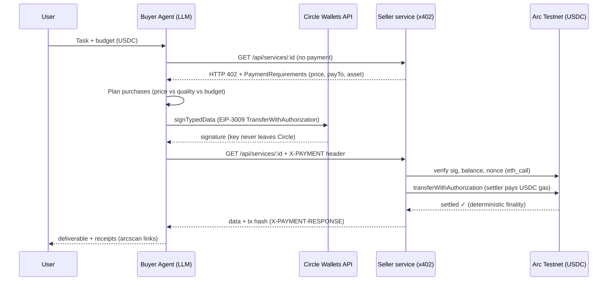

# 🕌 AgentSouq — Agentic Commerce on Arc

**Track 4: Best Agentic Economy Experience on Arc** · The Stablecoin Commerce Stack Challenge

AgentSouq is a marketplace ("souq") where **AI agents buy services from other agents and pay per call in USDC on Arc testnet**. A buyer agent receives a task and a budget, discovers priced services via HTTP 402 payment challenges (x402), reasons about which counterparties to buy from (price vs. quality vs. latency), signs gasless EIP-3009 USDC authorizations with its **Circle developer-controlled wallet**, and every purchase settles on-chain on Arc in seconds.

> For educational and testnet demo purposes only.

**Live demo:** _see submission_ · **Video:** _see submission_

---

## What it demonstrates

- **Autonomous stablecoin-settled purchases** — the agent executes real USDC settlements on Arc smart contracts (the native USDC token contract) without human intervention.
- **Multi-counterparty negotiation** — two sellers offer FX quotes at different price/quality points; the agent weighs the tradeoff against its task and budget and picks one.
- **Pay-per-inference / pay-per-call** — services are priced at $0.02–$0.10 per call; sub-cent pricing works identically (nanopayment-style economics).
- **Budget-governed spending** — the agent enforces a hard budget cap in code; every skipped or executed purchase is explained.
- **Gasless buyer UX** — the buyer only signs typed data (EIP-3009 `transferWithAuthorization`); the seller's settler submits the transaction and pays gas, which on Arc is itself USDC.

## Architecture



**Components** (single Next.js app):

| Piece | Where | What it does |
|---|---|---|
| Buyer agent | `src/lib/agent.ts` | LLM planner (DeepSeek via OpenRouter) + budget enforcement + purchase loop (deterministic fallback if no LLM key) |
| Circle Wallets signer | `src/lib/circle.ts` | Agent wallet is a Circle developer-controlled wallet on `ARC-TESTNET`; EIP-3009 authorizations are signed via `signTypedData` — the agent never touches a private key |
| x402 payment engine | `src/lib/payments.ts` | 402 challenges, signature/balance/nonce verification, on-chain settlement via `transferWithAuthorization` |
| Seller services | `src/app/api/services/[id]` | 4 paid endpoints across 3 sellers (FX quotes ×2 competing providers, market brief, translation), each with its own Circle wallet treasury |
| Dashboard | `src/app/page.tsx` | Live agent reasoning feed, settlements with Arcscan links, wallet balances |

**Wallets** — all created via Circle's developer-controlled wallets API on blockchain `ARC-TESTNET`:

- Agent (buyer): Circle wallet, signs payments
- FastFX / SouqData / LingoPay treasuries: Circle wallets, receive USDC
- Settler: EOA that submits settlement transactions (gas on Arc = USDC)

## Circle products used on Arc

- **USDC** — settlement asset *and* gas token. We use the Arc-native USDC at `0x3600000000000000000000000000000000000000` (6-decimal ERC-20 interface, FiatToken v2 with EIP-3009).
- **Circle Wallets (developer-controlled)** — the agent's wallet and all three seller treasuries. Entity-secret setup, wallet creation, and typed-data signing all via `@circle-fin/developer-controlled-wallets`.
- **Nanopayments (concept)** — per-call prices in cents; the same EIP-3009 flow supports sub-cent authorizations for high-frequency agentic payments.
- **Gateway / CCTP (roadmap)** — seller treasuries would sweep revenue via Gateway and rebalance cross-chain via CCTP + Bridge Kit; not required for the testnet demo.

## Running it

```bash
pnpm install
cp .env.example .env.local       # add your Circle testnet API key
node scripts/circle-setup.mjs    # one-time: registers entity secret, creates wallet set + agent wallet
node scripts/create-wallets.mjs  # creates the 3 seller treasury wallets
node scripts/gen-settler.mjs     # generates the settler EOA
pnpm dev                         # http://localhost:3000
```

Fund the **agent wallet** and **settler** with Arc testnet USDC at <https://faucet.circle.com> (network: Arc Testnet).

### Environment variables

| Var | Purpose |
|---|---|
| `CIRCLE_API_KEY` | Circle testnet API key (console.circle.com) |
| `CIRCLE_ENTITY_SECRET` | generated + registered by `scripts/circle-setup.mjs` |
| `CIRCLE_WALLET_SET_ID`, `CIRCLE_AGENT_WALLET_ID`, `CIRCLE_AGENT_WALLET_ADDRESS` | written by setup script |
| `CIRCLE_SELLER_{FASTFX,SOUQDATA,LINGO}_{ID,ADDRESS}` | written by `create-wallets.mjs` |
| `SETTLER_PRIVATE_KEY`, `SETTLER_ADDRESS` | written by `gen-settler.mjs` |
| `OPENROUTER_API_KEY` | optional — enables LLM planning/synthesis (deterministic fallback otherwise) |
| `OPENROUTER_MODEL` | optional — defaults to `deepseek/deepseek-v4-flash-0731` |

### Arc testnet reference

- Chain ID `5042002` · RPC `https://rpc.testnet.arc.io` · Explorer `https://testnet.arcscan.app`
- USDC: native gas token with ERC-20 interface at `0x36000…0000`, name `USDC`, EIP-712 version `2`

## The x402 flow in detail

1. Agent calls a service with no payment → server replies `402` with an x402 `accepts` array: scheme `exact`, network `eip155:5042002`, price, `payTo`, asset.
2. Agent builds an EIP-3009 `TransferWithAuthorization` message (random 32-byte nonce, 5-minute validity window) and signs it through Circle Wallets `signTypedData`.
3. Agent retries the call with the base64 `X-PAYMENT` header.
4. Server verifies: signature recovers to the buyer, `authorizationState` nonce unused, balance sufficient, amount ≥ price, window valid.
5. Settler submits `transferWithAuthorization(from, to, value, validAfter, validBefore, nonce, v, r, s)` on the USDC contract and waits for the receipt — deterministic finality on Arc means the seller can serve the response immediately.
6. Response carries the data plus `X-PAYMENT-RESPONSE` with the settlement tx hash.

## Circle Product Feedback

**Why we chose these products:** we wanted an agent that holds no raw keys (Circle Wallets custody + `signTypedData` maps perfectly onto EIP-3009 payment authorizations) and a chain where the settlement asset is also the gas asset (Arc), which removes the classic "agent needs two tokens" bootstrapping problem.

**What worked well:**

- Wallet creation on `ARC-TESTNET` worked first try via the SDK; entity-secret registration is scriptable end-to-end.
- `signTypedData` on a developer-controlled wallet signed EIP-3009 typed data that verified on-chain with no surprises — this makes Circle Wallets a drop-in signer for x402/agentic payments.
- Arc's USDC being FiatToken v2 (EIP-3009 intact) at a well-known address made gasless pull-payments trivial; USDC-as-gas simplified treasury logic to a single asset.
- Deterministic finality: `waitForTransactionReceipt` returns in ~1–2s, so payment-before-response APIs feel synchronous.

**What could be improved:**

- The faucet API (`POST /v1/faucet/drips`) returned `Forbidden` for our standard testnet key, forcing manual browser funding — programmatic faucet access for Arc would make agent demos fully scriptable.
- The SDK's `registerEntitySecretCiphertext` `recoveryFileDownloadPath` expects a directory but errors confusingly if given a file path; docs/error message could be clearer.
- No official x402 facilitator or network entry for Arc yet in the x402 packages — we had to implement the exact-scheme verify/settle ourselves. A Circle-hosted facilitator for Arc (or an Arc entry in x402's network registry) would cut integration to minutes.
- A first-class "sign EIP-3009 payment" helper in the Wallets SDK (amount, payee, token → X-PAYMENT header) would make Circle Wallets the default wallet for the agentic economy.

**Recommendations:** ship an Arc x402 quickstart (facilitator + Wallets signer), expose faucet drips to standard testnet API keys, and add webhook events for inbound `transferWithAuthorization` credits so seller treasuries can react without polling.

## Security notes

- Testnet only. The entity secret, API keys, and settler key live in `.env.local` (gitignored).
- Payment verification checks signature, nonce reuse (`authorizationState`), balance, amount, and validity window before settlement.

## License

MIT
